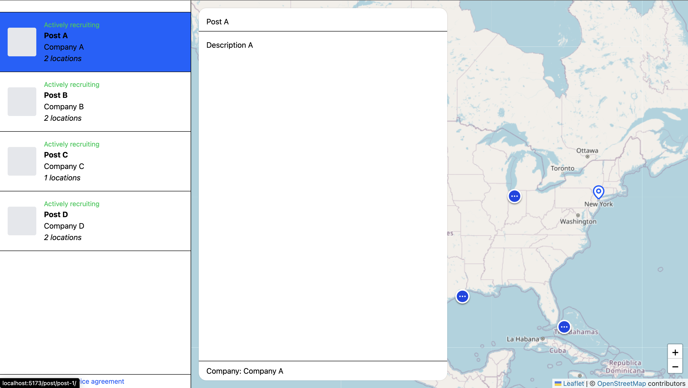
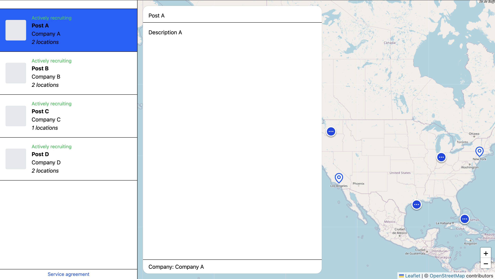

# CareerPCS evaluation

This is a stripped down version of the map app we have running on careerpcs.com/map.

## Excercise

With Leaflet and React, make it so that when you select a post from the list with multiple locations (like `post-1` and `post-4`), the map zooms out to show all the locations inside the visible viewport.

What I see when I currently click on Post A:

What I expect it to zoom to:

## Installation

This project uses [corepack](https://github.com/nodejs/corepack)!  
If you can't install that, use `pnpm@14.4.4` (don't think the exact version has to match but in case you run into errors)

Run `pnpm install`, then `npm run dev` anmd you are good to go!

## Guidelines

I expect it to be a pretty managable task, but if you find you are spending a lot more than 2 hours on it, let me know!
Possibly we'll ask you to commit what you have and we can evaluate that.
You are the first to attempt this excercise so I might have greatly underestimated the difficulty!

Please use any packages, tools, setups that you feel fit reasonable in the current setup.

Good luck!